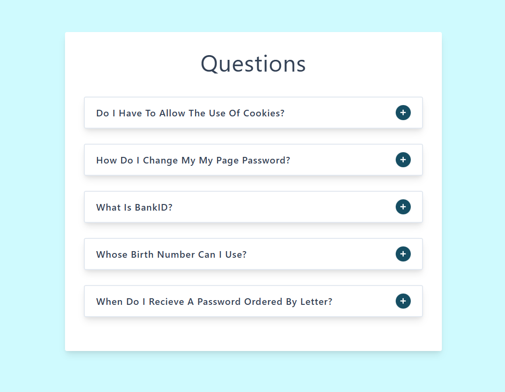

# 📚 Accordion App

A simple and interactive React accordion component that displays frequently asked questions (FAQs). Users can expand and collapse individual questions to reveal their answers.

## 🎨 UI Preview



## 📖 Project Overview

This project is a practical implementation of core React concepts including state management, component composition, conditional rendering, and user interactions. It demonstrates how to build reusable components and manage data flow between parent and child components.

## ✨ Key Concepts Applied

### 1. **React Hooks - useState**

- Implemented state management using the `useState` hook in `SingleQuestion.jsx`
- Uses `showAnswer` state to track whether an answer is displayed or hidden
- Demonstrates how to update state and trigger re-renders

```jsx
const [showAnswer, setShowAnswer] = useState(false);
```

### 2. **Component Composition**

- **App.jsx**: Root component that manages the questions data
- **Questions.jsx**: Container component that renders a list of questions
- **SingleQuestion.jsx**: Presentational component for individual Q&A items

This demonstrates the parent-child component hierarchy and data flow from App → Questions → SingleQuestion.

### 3. **Props & Data Flow**

- Data flows down from App.jsx to Questions.jsx as props
- Questions.jsx maps over array and passes individual question data to SingleQuestion.jsx
- Unidirectional data flow pattern (parent to child)

```jsx
// In Questions.jsx
{
  data.map((question) => {
    return (
      <SingleQuestion
        key={question.id}
        title={question.title}
        info={question.info}
      />
    );
  });
}
```

### 4. **Conditional Rendering**

- Shows/hides answer text based on `showAnswer` state
- Toggles icon (Plus/Minus) based on expanded state
- Demonstrates the ternary operator for conditional display

```jsx
{
  showAnswer ? <p>{info}</p> : "";
}
{
  showAnswer ? <FaMinus /> : <FaPlus />;
}
```

### 5. **Event Handling**

- `onClick` handler on toggle button
- Custom `toggleAnswer()` function that updates state
- Demonstrates React's synthetic event system

```jsx
<button type="button" className="question-btn" onClick={toggleAnswer}>
  {showAnswer ? <FaMinus /> : <FaPlus />}
</button>
```

### 6. **Key Prop in Lists**

- Uses unique `id` from data as the `key` prop when mapping
- Best practice for React list rendering

### 7. **Third-Party Icons**

- Integrates `react-icons` package for Plus/Minus icons
- Demonstrates external library usage in React

## 📁 Project Structure

```
accordian-app/
├── src/
│   ├── App.jsx          # Root component managing state
│   ├── data.js          # Questions data array
│   ├── index.css        # Global styles
│   ├── main.jsx         # Entry point
│   └── Components/
│       ├── Questions.jsx         # List container component
│       └── SingleQuestion.jsx    # Individual Q&A component
├── index.html
├── package.json
└── vite.config.js
```

## 🚀 Getting Started

### Prerequisites

- Node.js and npm installed on your machine

### Installation

1. Navigate to the project directory:

```bash
cd accordian-app
```

2. Install dependencies:

```bash
npm install
```

### Running the Application

Start the development server:

```bash
npm run dev
```

The application will open at `http://localhost:5173` (or specified port by Vite)

## 🔗 Design Reference

[View the Figma Design](https://www.figma.com/file/TAwJ3kWOqkw0o8UVtAMOHO/Accordion?node-id=0%3A1&t=1YEti8xBykw69tBH-1)

## 📦 Dependencies

- **React**: UI library
- **Vite**: Build tool and dev server
- **react-icons**: Icon library (FaPlus, FaMinus icons)

## 💡 Learning Resources

This project demonstrates fundamental React patterns that are essential for building modern web applications. The concepts applied here form the foundation for more complex state management patterns like Redux or Context API.

### Topics Covered:

- ✅ Functional Components
- ✅ Hooks (useState)
- ✅ Component Composition
- ✅ Props & Prop Drilling
- ✅ Conditional Rendering
- ✅ Event Handling
- ✅ Lists & Keys
- ✅ State Management

## 📝 License

This project is part of a React/TypeScript/Next.js learning course.
